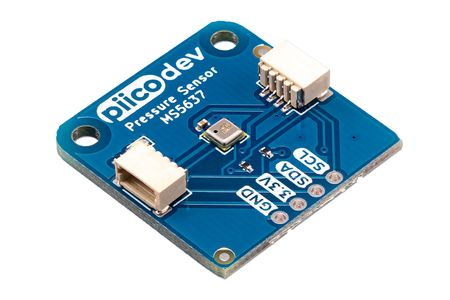

# PiicoDev® Pressure Sensor MS5637

This is the repo for the Core Electronics [PiicoDev Pressure Sensor](https://core-electronics.com.au/catalog/product/view/sku/CE07832).

Our PiicoDev® Pressure Sensor is perfect for measuring barometric pressure or infering altitude from air pressure - the on-board MS5637 is capable of measuring differences as small as 13cm! The accurate, MEMs pressure sensor is very sensitive, factory calibrated, low power and easy to use - forfect for home weather stations, detecting changes in altitude or pneumatic-based control projects.

**Features**

- Accurate air pressure measurements
- PiicoDev connector, compatible with Qwiic and STEMMA QT (3.3V only)
- 2.54mm breakout for breadboarding/prototyping
- Manufactured and [supported](https://core-electronics.com.au/contacts/) in Australia by Core Electronics
- [Getting Started Guides](https://core-electronics.com.au/catalog/product/view/sku/CE07832#guides)

**Technical Specifications**

- I2C address: 0x76
- Dimensions: 25.4x25.4mm
- Mounting Holes: 2x M2.5
- MS5637:
  - Operating range: 300 to 1200 hPa, -40 to 85°C
  - Error band at 25°C: ±2 hPa

## License
This project is open source - please review the LICENSE.md file for further licensing information.

If you have any technical questions, or concerns about licensing, please contact technical support on the [Core Electronics forums](https://forum.core-electronics.com.au/).
